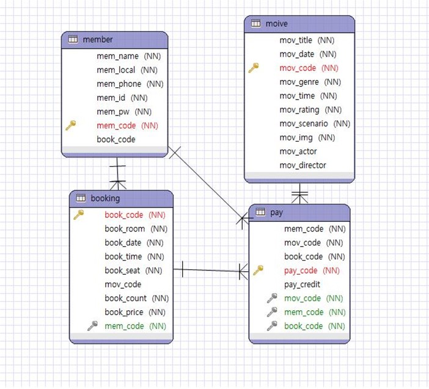
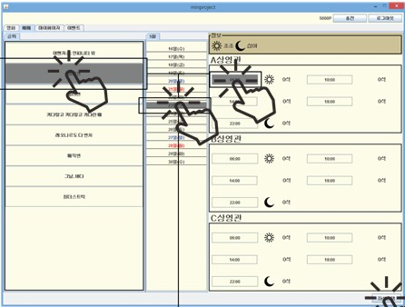
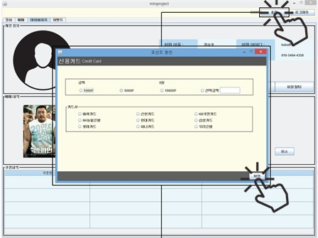

# 개발환경
* IDE : ECLIPSE
* JAVA Swing
* ORACLE XE

# 개발목표
* 남녀노소 부담없이 사용할 수 있는 시스템
* DB와 JAVA만으로 만들 수 있는 시스템

# 맡은 역할
- 영화목록 : N사의 최신 영화 목록들을 보여주기 위한 공간
- 예매관리 : N사의 최신 영화 목록들을 보여주기 위한 공간 및 영화 예매를 
               하기 위한 공간
- 결재 : 현금과 포인트의 비율을 1:1로 하여 카드사 별로 포인트를 충전하고 
          포인트로 결제를 하기 위함

# ER-Diagram

# 예시 이미지

